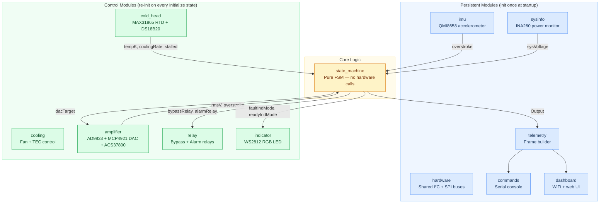
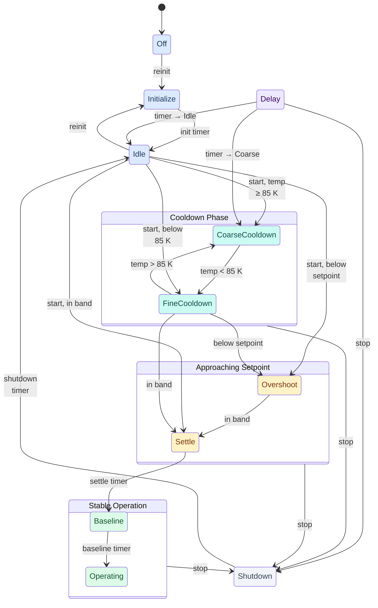
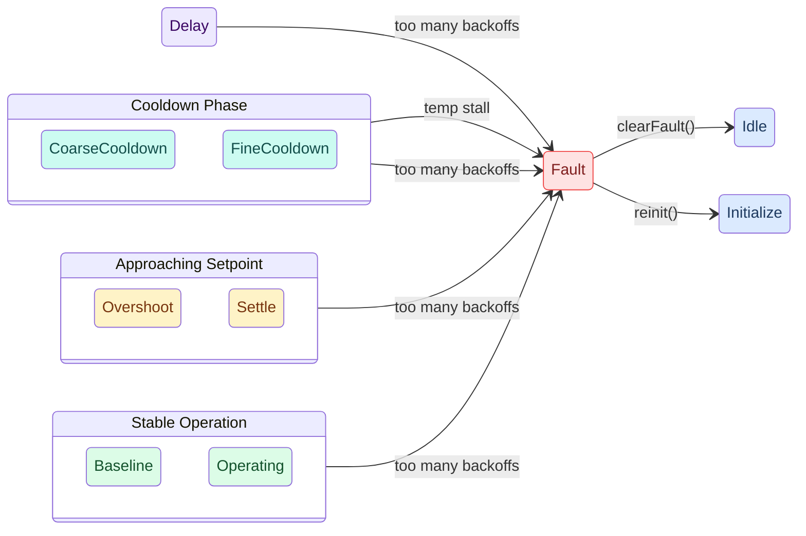
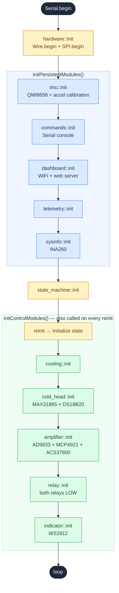
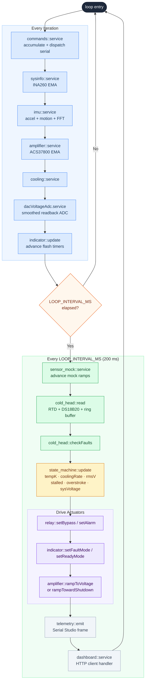

# ESP32-S3 Cryocooler Controller

Firmware for an ESP32-S3 DevKit that automates the cooldown sequence of a cryogenic cooler. The controller manages a compressor-driven cold stage through ten operational states — from a cold start at room temperature (~295 K) down to an operating setpoint of 78 K, with a graceful shutdown sequence — while enforcing thermal safety limits, detecting back-EMF current spikes, streaming live telemetry to Serial Studio, and serving real-time data as JSON over WiFi.

---

## Hardware

| Component | Part | Interface | Purpose |
|-----------|------|-----------|---------|
| Microcontroller | ESP32-S3 DevKitC-1 | — | Host MCU |
| Cold-stage sensor | MAX31865 + PT100 RTD | SPI (CS: GPIO 1) | Cold-stage temperature |
| Ambient sensor | DS18B20 / DS18S20 | 1-Wire (GPIO 4) | Room temperature |
| Waveform generator | AD9833 DDS | SPI (CS: GPIO 7) | 60 Hz sine wave for compressor |
| DAC | MCP4921 12-bit | SPI (CS: GPIO 6) | Compressor power control |
| Power monitor | INA260 | I²C (SDA: GPIO 8, SCL: GPIO 9) | Bus voltage + current |
| IMU | QMI8658 | I²C (SDA: GPIO 8, SCL: GPIO 9) | Vibration / overstroke detection |
| Status LED | WS2812 RGB | GPIO 38 | Fault / Ready indication |
| Bypass relay | — | GPIO 11 | Normal / Bypass switching |
| Alarm relay | — | GPIO 12 | External fault signalling |

**SPI bus** (shared by MAX31865, AD9833, MCP4921): MOSI → GPIO 42, MISO → GPIO 41, CLK → GPIO 40.

---

## Architecture



---

## Module Reference

### `hardware`

Initialises the shared I²C bus (`Wire.begin(SDA, SCL)`) and SPI bus (`SPI.begin(...)`) once at startup. All other modules access buses via `hardware::i2c()` and `hardware::spi()` rather than the global singletons. Provides `recoverI2c()` to reset the I²C bus to a clean idle state — used by `imu::init()` before probing the QMI8658.

---

### `state_machine`

The core of the controller. Ingests sensor readings every tick and outputs a complete set of actuator targets. Contains no hardware calls — pure logic, fully unit-testable on the host PC.

**States:**

| # | Name | Description | FAULT LED | READY LED | DAC |
|---|------|-------------|-----------|-----------|-----|
| -1 | Off | System powered down | Off | Off | 0 |
| 0 | Initialize | Power-up self-check | Solid Amber | Solid Amber | 0 |
| 1 | Idle | Warm standby | Solid Red | Off | 0 |
| 2 | CoarseCooldown | Cooling above 85 K | Flash Fast Red | Off | proportional to temp |
| 3 | FineCooldown | Cooling below 85 K | Flash Fast Red | Flash Slow Green | proportional to temp |
| 4 | Overshoot | Below setpoint, settling | Flash Fast Red | Flash Fast Green | 0 |
| 5 | Settle | In setpoint band; Normal relay | Flash Fast Red | Flash Fast Green | 0 |
| 6 | Baseline | Collecting pre-run baseline (5 min) | Off | Solid Green | 0 |
| 7 | Operating | Normal cryogenic operation | Off | Solid Green | 0 |
| 8 | Shutdown | Graceful shutdown; DAC ramps down | Off | Off | ramps → 0 |
| 9 | Delay | Timed hold; resumes at configured next state | Solid Amber | Solid Amber | 0 |
| 127 | Fault | Terminal fault state | Flash Fast Red | Off | 0 |

**Key configuration** (all in `config.h`):

| Constant | Default | Description |
|----------|---------|-------------|
| `SETPOINT_K` | 78.0 K | Target cold-stage temperature |
| `COARSE_FINE_THRESHOLD_K` | 85.0 K | Coarse/Fine transition boundary |
| `SETPOINT_TOLERANCE_K` | 2.0 K | Band around setpoint for settle/overshoot logic |
| `SETTLE_DURATION_MS` | 60 000 ms | Time stable before advancing to Baseline |
| `BASELINE_DURATION_MS` | 300 000 ms | Baseline collection window |
| `SHUTDOWN_DURATION_MS` | 5 000 ms | Graceful shutdown ramp duration |
| `STALL_DETECT_WINDOW_MS` | 600 000 ms | Stall detection observation window |
| `STALL_MIN_DROP_K` | 2.0 K | Minimum temp drop required in the window |
| `BACKOFF_DAC_STEP` | 200 counts | DAC reduction per overstroke event |
| `BACKOFF_MAX_COUNT` | 10 | Max overstroke events before TooManyBackoffs fault |

---

### `cold_head`

Drives the MAX31865 breakout board over SPI to read the PT100 RTD and converts raw resistance to Kelvin/Celsius. Also reads a DS18B20/DS18S20 on the 1-Wire bus for ambient temperature.

Maintains a ring buffer of `TEMP_HISTORY_SIZE` timestamped samples for cooling-rate calculation (K/min), stall detection, and cooldown progress (0–100 %).

| Function | Returns |
|----------|---------|
| `getLastTempK()` | Cold-stage temperature in Kelvin |
| `getLastTempC()` | Cold-stage temperature in Celsius |
| `getLastAmbientTempC()` | Room temperature in Celsius |
| `getCoolingRateKPerMin()` | K/min, positive = cooling |
| `isStalled()` | True if stall threshold exceeded |

---

### `amplifier`

Drives the AD9833 DDS (60 Hz sine wave), MCP4921 12-bit DAC (compressor power), and ACS37800 current sensor. Provides two ramp modes:

- `rampToVoltage(target)` — smooth ramp at ±`DAC_MAX_STEP_PER_INTERVAL` per tick
- `rampTowardShutdown(target)` — fast ramp at ±`DAC_SHUTDOWN_STEP_PER_INTERVAL` per tick

**Overstroke (back-EMF) detection:** A slow-tracking EMA forms the baseline. A reading exceeding `baseline + OVERSTROKE_CURRENT_THRESHOLD_A` fires `hasOverstroke()`, subject to `OVERSTROKE_DEBOUNCE_MS`. The EMA is primed for `OVERSTROKE_PRIME_READINGS` ticks on startup.

---

### `imu`

Drives the QMI8658 6-DOF IMU over I²C (accelerometer only; SA0 is tied high so the device is at address 0x6B). On `init()` the accelerometer is configured at 1000 Hz ODR (±8 g), then a one-time blocking calibration collects 1000 samples to compute per-axis offsets (gravity is removed from the Z offset). No `delay()` calls are used.

Each `service()` call applies calibration offsets, runs a first-order low-pass filter (α = 0.1), and computes roll/pitch from filtered acceleration. Motion / overstroke is flagged when acceleration magnitude deviates from 9.81 m/s² by more than `ACCEL_THRESHOLD_MPS2` (2.0); it clears after `MOTION_TIMEOUT_MS` (2000 ms) of stillness.

A periodic FFT (`calculateFrequency()`) detects the compressor vibration frequency in the 45–75 Hz band using 256 samples at 400 Hz, with Hann windowing and quadratic peak interpolation. It runs at most once every `FFT_INTERVAL_MS`.

| Function | Returns |
|----------|---------|
| `isInitialized()` | True if sensor was found and configured |
| `hasOverstroke()` | True while motion/overstroke is active |
| `getRoll()` / `getPitch()` | Orientation angles in degrees |
| `getAccelMag()` | Calibrated acceleration magnitude (m/s²) |
| `getFrequencyHz()` | Detected compressor frequency (Hz), or NAN |
| `getTemperature()` | IMU die temperature (°C) |

---

### `sysinfo`

Reads bus voltage and current via the INA260 power monitor over I²C. Applies EMA smoothing and exposes `getVoltage()`.

---

### `cooling`

Controls the cooling hardware (fan / TEC). Initialised as part of the control module group on every `Initialize` state entry.

---

### `relay`

Controls two GPIO-driven relays:

- **Bypass relay** (GPIO 11) — LOW = Bypass (safe default); HIGH = Normal (engaged during Settle, Baseline, Operating)
- **Alarm relay** (GPIO 12) — HIGH in Fault state only

Both pins are driven LOW during `init()`, ensuring a safe-default state at boot.

---

### `indicator`

Drives the on-board WS2812 RGB LED (GPIO 38) according to the state machine's requested `Mode`. All flash timing is non-blocking — `update(nowMs)` is called every loop iteration.

| Mode | Colour | Rate |
|------|--------|------|
| `SolidRed` | Red | — |
| `SolidGreen` | Green | — |
| `SolidAmber` | Amber | — |
| `FlashFastRed` | Red | 2 Hz |
| `FlashSlowGreen` | Green | 1 Hz |
| `FlashFastGreen` | Green | 2 Hz |

---

### `dashboard`

Connects to WiFi and serves the telemetry frame as JSON on port 80 (`GET /`). The response is built from `telemetry::fillJson()` — no additional hardware reads. WiFi credentials live in `src/arduino_secrets.h`.

---

### `commands`

Non-blocking USB serial command handler. `service()` accumulates characters and dispatches completed lines. The same `processLine()` function is used by unit tests with a stub `Print`.

| Command | Action |
|---------|--------|
| `start` | Begin cooldown; resumes at the correct state if already cold |
| `stop` | Abort cooldown, return to Idle |
| `off` | Return to Off state |
| `status` | Print current state and run duration |
| `summary` | Full snapshot of all sensor and actuator values |
| `board` | Print platform/build info |
| `help` | List all commands |

---

### `telemetry`

Snapshots all module values each tick into a `FrameBuilder`, sends the Serial Studio wire frame (`/*v1|v2|...*/\r<br/>`), and stores the last frame for `dashboard` and `commands` to retrieve without re-reading hardware.

---

### `frame_builder`

Format-agnostic telemetry frame with a fluent field API. Renders to Serial Studio wire format or `JsonDocument` from the same snapshot.

---

### `conversions`

Header-only pure-math utilities with no hardware dependencies — safe for native unit tests.

| Function | Description |
|----------|-------------|
| `rtdRawToResistance(raw, rRef)` | MAX31865 raw → Ω |
| `celsiusToKelvin(c)` | °C → K |
| `tempKToDacValue(...)` | Temperature → 12-bit DAC mapping |
| `msToHHMMSS(ms, buf)` | ms → `HH:MM:SS` string |

---

### `sensor_mock`

Injects synthetic sensor values into all modules for hardware-free FSM testing. When `sensor_mock::isActive()`, `read()`/`service()` in each module pull from `sensor_mock::get()` instead of hardware. Activated via the `mock` serial command.

---

## Transition Triggers

### Normal Operation Flow

`start()` selects the resume state from `tempK` and is valid from both **Off** and **Idle**. `Delay` is reachable from any non-Fault state via `startDelay()` — see [Global Transitions](#global-transitions).



### Fault Conditions



### Global Transitions

These originate from all non-Fault states and are omitted from the diagrams above.

| Trigger | Condition | To |
|---------|-----------|-----|
| `off()` | — | Off |
| RMS overvoltage | `amplifier RMS V > AMPLIFIER_MAX_VOLTAGE` | Fault |
| Low system voltage | `systemVoltage > 0` and `< MIN_SYSTEM_VOLTAGE_VDC` | Fault |
| State oscillation | Same two states alternate ≥ `FSM_OSCILLATION_MIN_CYCLES` times in window | Fault |
| `startDelay()` | — | Delay |

---

## Setup Sequence



---

## Loop Sequence



---

## Build & Configuration

### Dependencies (`platformio.ini`)

| Library | Purpose |
|---------|---------|
| `adafruit/Adafruit MAX31865 library` | PT100 RTD sensor |
| `majicdesigns/MD_AD9833` | DDS waveform generator |
| `bblanchon/ArduinoJson` | JSON serialisation |
| `mathieucarbou/ESPAsyncWebServer` | Async HTTP server |
| `robtillaart/RunningAverage` | Running average utility |
| `jonblack/arduino-fsm` | Finite state machine |
| `adafruit/Adafruit INA260 Library` | I²C power monitor |
| `pololu/ACS37800` | AC current sensor |
| `kosme/arduinoFFT` | FFT for vibration frequency detection |
| `lahavg/QMI8658` | 6-DOF IMU driver |

Local libraries in `lib/` (project-specific, not from the registry):

| Library | Purpose |
|---------|---------|
| `ContinuousZMCT103C` | Non-blocking AC current RMS sampling |
| `Device-Defined-Dashboard` | Serial Studio dashboard JSON generator |

### Platform

```ini
platform = espressif32@5.3.0   ; Arduino Core 2.0.6 + IDF 4.4.x
board    = esp32-s3-devkitc-1-n32r16v
```

To revert to pioarduino Core 3.x, replace with:
```
platform = https://github.com/pioarduino/platform-espressif32/releases/download/55.03.37/platform-espressif32.zip
```

### WiFi credentials

Create `src/arduino_secrets.h` (excluded from version control):

```cpp
#define WIFI_SSID "your-network-name"
#define WIFI_PASS "your-password"
```

### Key tuning parameters

All application-level constants live in `config.h`. Hardware pin assignments live in `pin_config.h`. Neither file has hardware includes, so both are safe to include in native unit tests.

---

## Testing

Unit tests run on the host PC via PlatformIO's native environment:

```bash
pio test -e native
```

Tests use a minimal Arduino stub (`test/test_native/stubs/`) that provides `millis()`, a `Print` class, and other shims. The state machine, serial command handler, and telemetry modules are compiled and exercised without hardware.

Embedded integration tests (requiring hardware) live in `test/test_embedded/` and run via:

```bash
pio test -e esp32s3
```
