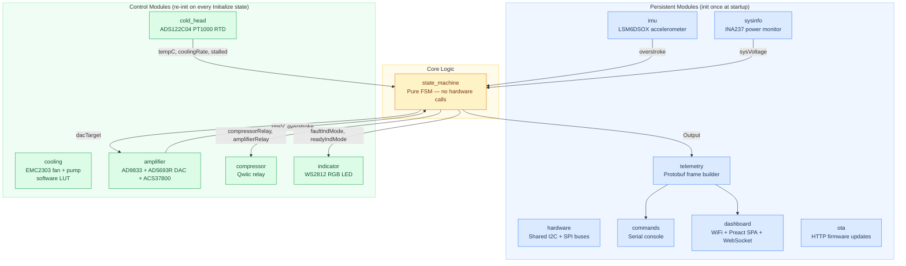
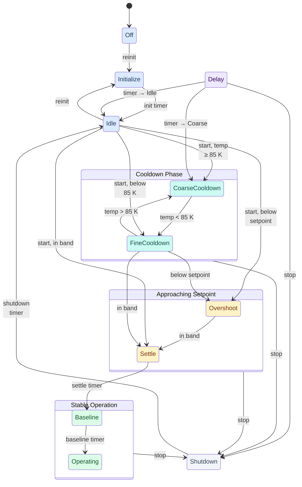
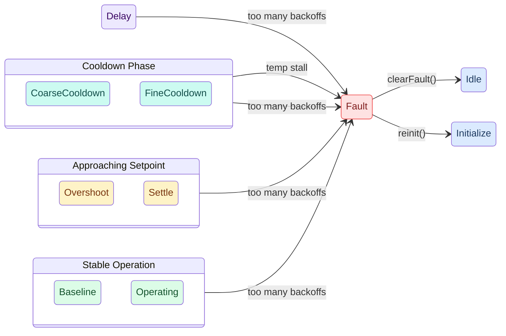

# ESP32-S3 Cryocooler Controller

Firmware for an ESP32-S3 DevKit that automates the cooldown sequence of a cryogenic cooler. The controller manages a compressor-driven cold stage through ten operational states — from a cold start at room temperature (~295 K) down to an operating setpoint of 78 K, with a graceful shutdown sequence — while enforcing thermal safety limits, detecting back-EMF current spikes, streaming live telemetry via Protobuf over WebSocket, and serving a real-time Preact dashboard over WiFi.

---

## Hardware

| Component | Part | Interface | Address / Pin | Purpose |
|-----------|------|-----------|---------------|---------|
| Microcontroller | ESP32-S3 DevKitC-1-N32R16V | — | — | Host MCU (32 MB flash, 16 MB PSRAM) |
| Cold-stage sensor | ADS122C04 + PT1000 RTD | I2C | 0x45 | Cold-stage temperature (4-wire, ratiometric) |
| Waveform generator | AD9833 DDS | SPI | CS: GPIO 7 | 60 Hz sine wave for compressor |
| DAC | AD5693R 16-bit | I2C | 0x4E | Amplifier power control |
| Power monitor | INA237 | I2C | auto | Bus voltage + current |
| IMU | LSM6DSOX 6-DOF | I2C | 0x6A | Vibration / overstroke detection |
| Fan / pump controller | EMC2303 three-channel PWM | I2C | 0x2F | Cooling fan (ch 0) + pump (ch 1) |
| Current sensor | ACS37800 | I2C | auto | Amplifier AC current monitoring |
| Compressor relay | SparkFun Qwiic Single Relay | I2C | 0x19 | Compressor on/off |
| Amplifier relay | SparkFun Qwiic Single Relay | I2C | 0x18 | Amplifier on/off |
| Coolant flow sensor | Alphacool ES (Hall-effect) | GPIO 10 | — | Coolant flow pulses |
| Coolant temperature | NTC thermistor | ADC GPIO 2 | — | Coolant temp via voltage divider |
| Status LED | WS2812 RGB | GPIO 38 | — | Fault / Ready indication |

**I2C bus:** SDA → GPIO 8, SCL → GPIO 9.

**SPI bus** (AD9833 only): CLK → GPIO 42, MISO → GPIO 41, MOSI → GPIO 40.

**Fan fault alert:** EMC2303 ALERT# → GPIO 14 (active-low, external pull-up).

---

## Architecture

All subsystem modules follow a standardised lifecycle pattern built on a CRTP base class (`ModuleBase<T>`) with compile-time interface enforcement. Modules are registered in declarative arrays and initialised/serviced via generic helpers — adding a new module is a one-liner. See [`docs/modules.md`](docs/modules.md) for the full module authoring guide.



---

## Module Reference

### hardware

Initialises the shared I2C bus (`Wire.begin(SDA, SCL)`) and SPI bus (`SPI.begin(...)`) once at startup. All other modules access buses via `hardware::i2c()` and `hardware::spi()` rather than the global singletons. Provides `recoverI2c()` to reset the I2C bus to a clean idle state after a failed transaction, and an error monitor (`reportI2cError()` / `serviceI2c()`) that triggers automatic bus recovery when error counts exceed a threshold.

---

### state_machine

The core of the controller. Ingests sensor readings every tick and outputs a complete set of actuator targets. Contains no hardware calls — pure logic, fully unit-testable on the host PC.

**States:**

| # | Name | Description | FAULT LED | READY LED | DAC |
|---|------|-------------|-----------|-----------|-----|
| -1 | Off | System powered down | Off | Off | 0 |
| 0 | Initialize | Power-up self-check | Solid Amber | Solid Amber | 0 |
| 1 | Idle | Warm standby | Solid Red | Off | 0 |
| 2 | CoarseCooldown | Cooling above 85 K | Flash Fast Red | Off | proportional to temp |
| 3 | FineCooldown | Cooling below 85 K | Flash Fast Red | Flash Slow Green | proportional to temp |
| 4 | Overshoot | Below setpoint, settling | Flash Fast Red | Flash Fast Green | 0 |
| 5 | Settle | In setpoint band; Normal relay | Flash Fast Red | Flash Fast Green | 0 |
| 6 | Baseline | Collecting pre-run baseline (5 min) | Off | Solid Green | 0 |
| 7 | Operating | Normal cryogenic operation | Off | Solid Green | 0 |
| 8 | Shutdown | Graceful shutdown; DAC ramps down | Off | Off | ramps → 0 |
| 9 | Delay | Timed hold; resumes at configured next state | Solid Amber | Solid Amber | 0 |
| 127 | Fault | Terminal fault state | Flash Fast Red | Off | 0 |

**Key configuration** (all in `config.h`):

| Constant | Default | Description |
|----------|---------|-------------|
| `SETPOINT_C` | -195.15 °C (78 K) | Target cold-stage temperature |
| `COARSE_FINE_THRESHOLD_C` | -188.15 °C (85 K) | Coarse/Fine transition boundary |
| `SETPOINT_TOLERANCE_C` | 3.0 °C | Band around setpoint for settle/overshoot logic |
| `SETTLE_DURATION_MS` | 60 000 ms | Time stable before advancing to Baseline |
| `BASELINE_DURATION_MS` | 300 000 ms | Baseline collection window |
| `SHUTDOWN_DURATION_MS` | 5 000 ms | Graceful shutdown ramp duration |
| `STALL_DETECT_WINDOW_MS` | 600 000 ms | Stall detection observation window |
| `STALL_MIN_DROP_C` | 2.0 °C | Minimum temp drop required in the window |
| `BACKOFF_MAX_COUNT` | 10 | Max overstroke events before TooManyBackoffs fault |

---

### cold_head

Reads the PT1000 RTD via the ADS122C04 24-bit ADC over I2C (address 0x45). The ADC is configured for 4-wire ratiometric measurement with 250 µA IDAC excitation and a 3854 Ω external reference resistor. Raw ADC counts are converted to resistance, then to temperature via the Callendar-Van Dusen equation (above 0 °C) and AN709 polynomial (below 0 °C).

Uses a non-blocking two-phase state machine: start single-shot conversion → poll DRDY → read 24-bit result. Maintains a ring buffer of `TEMP_HISTORY_SIZE` timestamped samples for cooling-rate calculation (°C/min), stall detection, and cooldown progress (0–100 %).

| Function | Returns |
|----------|---------|
| `getLastTempK()` | Cold-stage temperature in Kelvin |
| `getLastTempC()` | Cold-stage temperature in Celsius |
| `getCoolingRateCPerMin()` | °C/min, positive = cooling |
| `isStalled()` | True if stall threshold exceeded |

---

### amplifier

Drives the AD9833 DDS (60 Hz sine wave), AD5693R 16-bit DAC (compressor power), and ACS37800 current sensor. Provides two ramp modes:

- `rampToVoltage(target)` — smooth ramp at ±`DAC_MAX_STEP_PER_INTERVAL` per tick
- `rampTowardShutdown(target)` — fast ramp at ±`DAC_SHUTDOWN_STEP_PER_INTERVAL` per tick

**Overstroke (back-EMF) detection:** A slow-tracking EMA forms the baseline. A reading exceeding `baseline + OVERSTROKE_CURRENT_THRESHOLD_A` fires `hasOverstroke()`, subject to `OVERSTROKE_DEBOUNCE_MS`. The EMA is primed for `OVERSTROKE_PRIME_READINGS` ticks on startup.

---

### imu

Drives the LSM6DSOX 6-DOF IMU over I2C (accelerometer only). On `init()` the accelerometer is configured and a one-time blocking calibration collects samples to compute per-axis offsets (gravity is removed from the Z offset).

Each `service()` call applies calibration offsets, runs a first-order low-pass filter, and computes roll/pitch from filtered acceleration. Motion / overstroke is flagged when acceleration magnitude deviates from 9.81 m/s² by more than `ACCEL_THRESHOLD_MPS2`; it clears after `MOTION_TIMEOUT_MS` of stillness.

A periodic FFT (`calculateFrequency()`) detects the compressor vibration frequency in the 45–75 Hz band using 256 samples at 400 Hz, with Hann windowing and quadratic peak interpolation.

| Function | Returns |
|----------|---------|
| `isInitialized()` | True if sensor was found and configured |
| `hasOverstroke()` | True while motion/overstroke is active |
| `getRoll()` / `getPitch()` | Orientation angles in degrees |
| `getAccelMag()` | Calibrated acceleration magnitude (m/s²) |
| `getFrequencyHz()` | Detected compressor frequency (Hz), or NAN |
| `getTemperature()` | IMU die temperature (°C) |

---

### sysinfo

Reads bus voltage and current via the INA237 power monitor over I2C. Applies EMA smoothing and exposes `getVoltage()`.

---

### cooling

Controls the cooling fan and pump via a single EMC2303 three-channel PWM controller over I2C (address 0x2F). Uses a custom `EMC230x` Arduino library (in `lib/EMC230x/`).

**Software LUT:** Replaces the previous EMC2101 hardware LUT. Each channel has an independently-configured temperature-to-duty lookup table with hysteresis, evaluated once per second from coolant temperature. Entries are sorted ascending by temperature; the evaluator only writes to the chip when the active row changes.

**Deferred init:** The EMC2303 is powered from a 3.3 V regulator derived from the 12 V rail. If 12 V is absent at boot, `init()` fails gracefully and `service()` retries once per second until the chip appears, then promotes itself to `MODULE_INIT_SUCCESS`.

**Fault detection:** The EMC2303's open-drain ALERT# pin (GPIO 14, external pull-up) is sampled every service tick. When asserted (LOW), all four status registers (fan, stall, spin-up, drive-fail) are read and decoded. Faults are exposed via `hasFanFault()` / `getFanFaultDurationMs()` and included in the telemetry frame.

**I2C bus recovery:** When the EMC2303 loses power mid-operation, it can hold the I2C SDA line low and block all other sensors on the shared bus. The service function calls `hardware::recoverI2c()` immediately on detecting an I2C failure to free the bus for other devices.

**Pump normalisation:** User-facing pump speeds are 0–100 % normalised, mapped to 0–`COOLING_PUMP_MAX_DUTY_PCT` (raw 0–255) at the hardware boundary. The pump stalls above ~16 % effective duty (~4400 RPM).

**Tracking monitors:** Score-based monitors for fan duty, coolant temperature, and flow rate detect sustained deviations from expected values.

| Function | Returns |
|----------|---------|
| `getCoolantTemperature()` | Coolant temperature in °C |
| `getCoolantFlowRate()` | Coolant flow rate in L/min |
| `getFanSpeed()` | Fan duty (0–255) |
| `getFanRPM()` | Fan tachometer RPM |
| `getPumpSpeed()` | Pump speed (normalised 0–100 %) |
| `getPumpRPM()` | Pump tachometer RPM |
| `hasFanFault()` | True while ALERT# is asserted |
| `getFanFaultDurationMs()` | Duration of current fault episode |

---

### compressor

Manages the compressor relay (SparkFun Qwiic Single Relay at 0x19) with timed-run support. `compressor start <duration>` energises the relay for a specified duration (e.g. `1h30m`, `45s`), clamped to `COMPRESSOR_MAX_RUN_MS`. Can be disabled at compile time with `ENABLE_COMPRESSOR false`.

---

### indicator

Drives the on-board WS2812 RGB LED (GPIO 38) according to the state machine's requested `Mode`. All flash timing is non-blocking — `update(nowMs)` is called every loop iteration.

| Mode | Colour | Rate |
|------|--------|------|
| `SolidRed` | Red | — |
| `SolidGreen` | Green | — |
| `SolidAmber` | Amber | — |
| `FlashFastRed` | Red | 2 Hz |
| `FlashSlowGreen` | Green | 1 Hz |
| `FlashFastGreen` | Green | 2 Hz |

---

### dashboard

Connects to WiFi and serves a Preact single-page application with real-time telemetry:

- **HTTP** (port 80): serves the embedded SPA (`index.html`, `app.js`, `style.css`) and a JSON telemetry endpoint at `GET /api/telemetry`
- **WebSocket** (port 8080): streams Protobuf-encoded telemetry frames at 1 Hz
- **mDNS**: `cryocooler.local`

The dashboard frontend uses Preact + MUI + Vite and is bundled into firmware flash at build time via `scripts/embed_web.py`. WiFi credentials live in `include/arduino_secrets.h`.

---

### ota

HTTP OTA firmware update endpoint. `GET /ota` serves an upload form; `POST /ota` flashes new firmware. Enabled with `ENABLE_OTA true` in `config.h`.

---

### commands

Non-blocking USB serial command handler. `service()` accumulates characters and dispatches completed lines. The same `processLine()` function is used by the TCP server and by unit tests with a stub `Print`.

| Command | Action |
|---------|--------|
| `start` | Begin cooldown (from Off or Idle) |
| `stop` | Abort and return to Idle |
| `off` | Power off the system entirely |
| `reboot` | Reboot the MCU |
| `status` | Print current state and running flag |
| `summary` | Full snapshot of all sensor and actuator values |
| `fsm state` | Print current FSM state with time-in-state |
| `fsm history` | Print recent FSM state transitions |
| `fault clear` | Clear an active fault and return to Idle |
| `fault history` | Print fault log with reason and clear method |
| `board` | Print compile-time board/platform info |
| `i2c scan` | Scan I2C bus and print responding addresses |
| `reinit` | Re-initialise all or named modules |
| `cooling on/off` | Enable / disable cooling system |
| `cooling fan <N>` | Set fan: raw duty (0–255) or percent (0–100%) |
| `cooling pump <N>` | Set pump: raw duty (0–255) or percent (0–100%) |
| `set vout <V>` | Set DAC output voltage (0–120 V, 0–100 %, or `auto`) |
| `get vout` | Get current DAC output voltage |
| `relay` | Show current state of both relays |
| `relay amplifier on/off` | Control amplifier relay |
| `relay compressor on/off` | Control compressor relay |
| `compressor start <dur>` | Start timed compressor run (e.g. `1h30m`) |
| `compressor status` | Show compressor state and remaining time |
| `compressor stop` | Stop the compressor immediately |
| `telemetry on/off` | Enable / disable telemetry output |
| `telemetry delta on/off` | Delta-only or full frames |
| `dashboard on/off` | Enable / disable dashboard TCP broadcasts |
| `mock ...` | Sensor mock: `enable`, `disable`, `status`, `temp`, etc. |
| `ota status` | Print OTA partition and firmware version info |
| `update image` | Flash new firmware via HTTP upload |
| `help` | List all commands |

---

### telemetry

Snapshots all module values each tick into a `FrameBuilder`. The WebSocket path encodes frames as Protobuf binary via Nanopb; the HTTP `/api/telemetry` endpoint returns JSON. The schema source of truth is `proto/telemetry.proto`.

---

### frame_builder

Format-agnostic telemetry frame with a fluent field API. Renders to Serial Studio wire format or `JsonDocument` from the same snapshot.

---

### conversions

Header-only pure-math utilities with no hardware dependencies — safe for native unit tests.

| Function | Description |
|----------|-------------|
| `resistanceToTemperaturePT1000(R)` | PT1000 Ω → °C (Callendar-Van Dusen / AN709) |
| `tempCToDacValue(...)` | Temperature → 12-bit DAC mapping |
| `tempCToFraction(...)` | Temperature → cooldown fraction [0.0, 1.0] |
| `msToHHMMSS(ms, buf)` | ms → `HH:MM:SS` string |
| `parseDurationMs(str, ...)` | Human duration string → ms (e.g. `1h30m`) |
| `formatDurationMs(ms, buf, len)` | ms → compact human string (e.g. `1h 30m 00s`) |

---

### sensor_mock

Injects synthetic sensor values into all modules for hardware-free FSM testing. When `sensor_mock::isActive()`, `read()`/`service()` in each module pull from `sensor_mock::get()` instead of hardware. Activated via the `mock` serial command.

---

## Transition Triggers

### Normal Operation Flow

`start()` selects the resume state from `tempK` and is valid from both **Off** and **Idle**. `Delay` is reachable from any non-Fault state via `startDelay()` — see [Global Transitions](#global-transitions).



### Fault Conditions



### Global Transitions

These originate from all non-Fault states and are omitted from the diagrams above.

| Trigger | Condition | To |
|---------|-----------|-----|
| `off()` | — | Off |
| RMS overvoltage | `amplifier RMS V > AMPLIFIER_MAX_VOLTAGE_VAC` | Fault |
| Low system voltage | `systemVoltage > 0` and `< MIN_SYSTEM_VOLTAGE_VDC` | Fault |
| State oscillation | Same two states alternate ≥ `FSM_OSCILLATION_MIN_CYCLES` times in window | Fault |
| `startDelay()` | — | Delay |

---

## Build Pipeline

The firmware build runs three pre-build scripts in order before PlatformIO compiles:

### 1. Protobuf compilation (scripts/compile_proto.py)

Compiles `proto/telemetry.proto` into Nanopb C stubs (`src/generated/telemetry.pb.c`, `include/generated/telemetry.pb.h`). Auto-installs the `google.protobuf` Python package if missing.

Skip with `SKIP_PROTO_BUILD=1 pio run`.

### 2. Dashboard build (scripts/build_dashboard.py)

Runs `npm ci` in `dashboard/`, generates protobufjs stubs (`npm run proto:build`), then builds the Vite SPA (`npm run build`) into `data/`.

Skip with `SKIP_DASHBOARD_BUILD=1 pio run`.

### 3. Web embedding (scripts/embed_web.py)

Embeds `data/*.html/css/js` as `PROGMEM const char[]` arrays in `include/web_content.h`. The SPA is served directly from flash — no filesystem needed.

### Quick firmware iteration

```bash
SKIP_DASHBOARD_BUILD=1 pio run          # firmware only, skip npm/vite
SKIP_DASHBOARD_BUILD=1 pio run -t upload  # build + flash
```

---

## Dependencies

### PlatformIO libraries (platformio.ini)

| Library | Purpose |
|---------|---------|
| `majicdesigns/MD_AD9833` | DDS waveform generator |
| `bblanchon/ArduinoJson` | JSON serialisation |
| `mathieucarbou/ESPAsyncWebServer` | Async HTTP + WebSocket server |
| `robtillaart/RunningAverage` | Running average utility |
| `jonblack/arduino-fsm` | Finite state machine |
| `adafruit/Adafruit INA237 and INA238 Library` | I2C power monitor |
| `pololu/ACS37800` | AC current sensor |
| `kosme/arduinoFFT` | FFT for vibration frequency detection |
| `adafruit/Adafruit LSM6DS` | 6-DOF IMU driver |
| `adafruit/Adafruit AD569x Library` | AD5693R DAC |
| `sparkfun/SparkFun Qwiic Relay Arduino Library` | Relay control |
| `nanopb/Nanopb` | Protobuf C encoder/decoder |
| `sparkfun/SparkFun ADS122C04 ADC Arduino Library` | 24-bit ADC for PT1000 RTD |

### Local libraries (lib/)

| Library | Purpose |
|---------|---------|
| `EMC230x` | EMC2301/02/03/05 dual PWM fan/pump controller |
| `ContinuousZMCT103C` | Non-blocking AC current RMS sampling |
| `Device-Defined-Dashboard` | Serial Studio dashboard JSON generator |

### Dashboard (dashboard/package.json)

| Package | Purpose |
|---------|---------|
| Preact | Lightweight UI framework |
| MUI (Material UI) | Component library |
| MUI X-Charts | Telemetry chart components |
| Vite | Build tooling |
| protobufjs | WebSocket telemetry decoding |

### Platform

```ini
platform = espressif32@5.3.0   ; Arduino Core 2.0.6 + IDF 4.4.x
board    = esp32-s3-devkitc-1-n32r16v
```

---

## Setup

### WiFi credentials

Create `include/arduino_secrets.h` (excluded from version control):

```cpp
#define WIFI_SSID "your-network-name"
#define WIFI_PASS "your-password"
```

### Key tuning parameters

All application-level constants live in `config.h`. Hardware pin assignments live in `pin_config.h`. Internal algorithm parameters live in `config_advanced.h`. None have hardware includes, so all are safe to include in native unit tests.

---

## Testing

Unit tests run on the host PC via PlatformIO's native environment:

```bash
pio test -e native
```

Tests use a minimal Arduino stub (`test/test_native/stubs/`) that provides `millis()`, a `Print` class, and other shims. The state machine, serial command handler, and telemetry modules are compiled and exercised without hardware.

Embedded integration tests (requiring hardware) live in `test/test_embedded/` and run via:

```bash
pio test -e esp32s3
```
