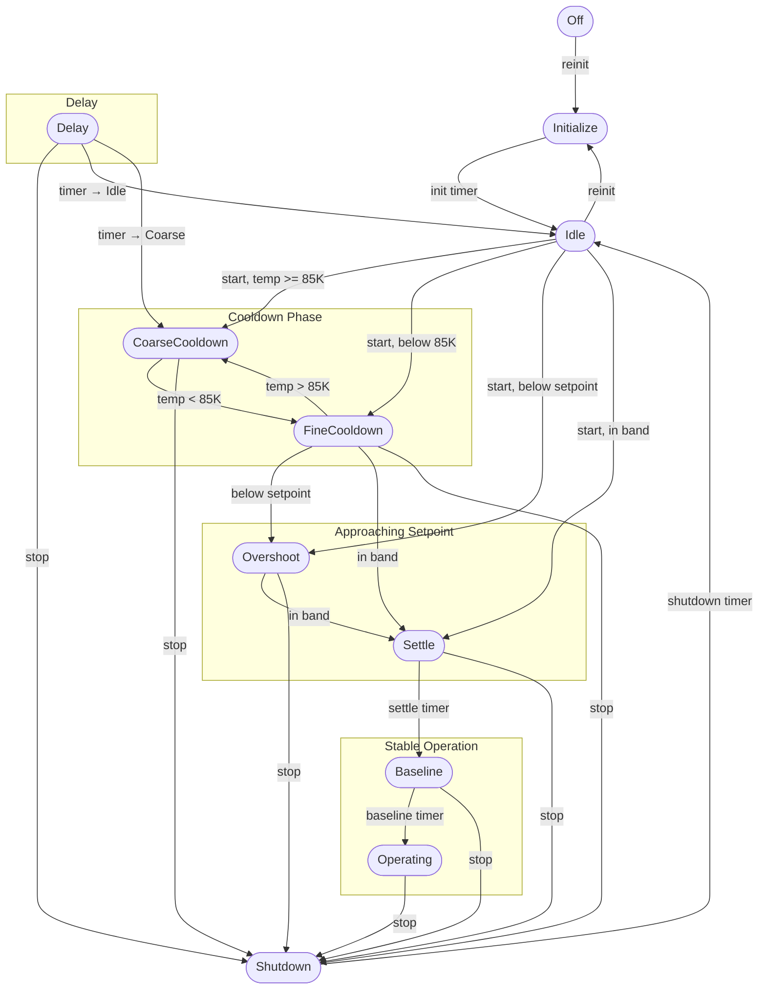
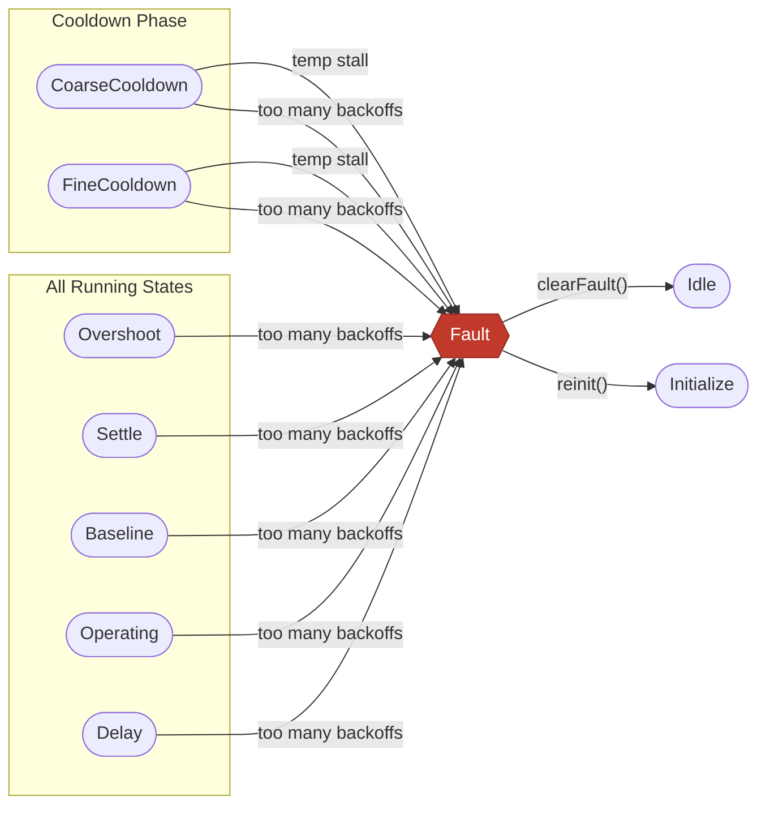

# Cryocooler State Machine

## Diagram

### Normal operation flow

`start()` selects the resume state from `tempK` and is valid from both **Off**
and **Idle**; only the Idle transitions are shown to reduce clutter.

### Fault conditions

Three fault types — **RMS overvoltage**, **low system voltage**, and **state
oscillation** — fire from *any* non-Fault state and are in the
[Global Transitions](#global-transitions-any-state) table.  The diagram below
shows only the faults that are gated to specific states.

---

## Global Transitions (any state)

These transitions originate from all non-Fault states and are omitted from the
diagram above to keep it readable.

| Trigger | Condition | To | FaultReason |
|---|---|---|---|
| `off()` | — | Off | — |
| RMS overvoltage | `amplifier RMS V > AMPLIFIER_MAX_VOLTAGE` | Fault | `RmsOvervoltage` |
| Low system voltage | `systemVoltage > 0` and `systemVoltage < MIN_SYSTEM_VOLTAGE_VDC` | Fault | `LowSystemVoltage` |
| State oscillation | FSM alternates between same two states >= `FSM_OSCILLATION_MIN_CYCLES` times within `FSM_OSCILLATION_WINDOW_MS` | Fault | `StateOscillation` |
| `startDelay()` | — | Delay | — |

---

## State Reference

| State | Value | Relay | FAULT indicator | READY indicator | DAC target |
|---|:-:|---|---|---|---|
| Off | -1 | Bypass | Off | Off | 0 |
| Initialize | 0 | Bypass | Solid Amber | Solid Amber | 0 |
| Idle | 1 | Bypass | Solid Red | Off | 0 |
| CoarseCooldown | 2 | Bypass | Flash Fast Red | Off | proportional to temp |
| FineCooldown | 3 | Bypass | Flash Fast Red | Flash Slow Green | proportional to temp |
| Overshoot | 4 | Bypass | Flash Fast Red | Flash Fast Green | 0 |
| Settle | 5 | **Normal** | Flash Fast Red | Flash Fast Green | 0 |
| Baseline | 6 | **Normal** | Off | Solid Green | 0 |
| Operating | 7 | **Normal** | Off | Solid Green | 0 |
| Shutdown | 8 | Bypass | Off | Off | ramping to 0 (fast) |
| Delay | 9 | Bypass | Solid Amber | Solid Amber | 0 |
| Fault | 127 | Bypass + **Alarm** | Flash Fast Red | Off | 0 |

The DAC target is computed proportional to how far `tempK` has dropped from
`AMBIENT_START_K` toward `SETPOINT_K`, and is only non-zero during
CoarseCooldown and FineCooldown.  The amplifier ramps toward the target each
tick; Shutdown uses a faster ramp rate via `amplifier::rampTowardShutdown()`.

---

## Fault Reference

| FaultReason | Value | Trigger | Originating states |
|---|:-:|---|---|
| RmsOvervoltage | 1 | `amplifier::getLastRmsVoltage() > AMPLIFIER_MAX_VOLTAGE` | Any non-Fault |
| TemperatureStall | 2 | Stall-detect window expired without sufficient temp drop | CoarseCooldown, FineCooldown |
| TooManyBackoffs | 3 | `backoffCount >= BACKOFF_MAX_COUNT` | All running states |
| LowSystemVoltage | 4 | `systemVoltage < MIN_SYSTEM_VOLTAGE_VDC` (0.0 ignored) | Any non-Fault |
| StateOscillation | 5 | FSM oscillation detector fired | Any non-Fault |

Fault is a **terminal state**. The only exits are `clearFault()` to Idle and
`reinit()` to Initialize. Both paths reset `faultReason`, `backoffCount`, and
`backoffDacOffset`.

---

## Behavioural Notes

**start() resume logic** — The starting state is chosen from the current
cold-stage temperature so the system resumes correctly after a power cycle
without triggering spurious stall faults.  `start()` is valid from both Off
and Idle with identical temperature-based branching.

**Settle timer** — The timer only advances while the temperature is inside the
setpoint band (`SETPOINT_K +/- SETPOINT_TOLERANCE_K`).  Any excursion out of
band resets the timer to zero; the full `SETTLE_DURATION_MS` must elapse
continuously in-band before the transition to Baseline fires.

**Back-EMF backoff** — Each overstroke event detected by the IMU reduces the
effective DAC target by `BACKOFF_DAC_STEP`.  The penalty accumulates until
`BACKOFF_MAX_COUNT` is reached, at which point the `TooManyBackoffs` fault is
triggered.  The offset and counter both reset on `clearFault()` and `reinit()`.

**Delay state** — A generic timed hold reachable from any non-Fault state via
`startDelay(nowMs, durationMs, nextState)`.  The destination is either Idle or
CoarseCooldown; any other value defaults to Idle.  `stop()` can interrupt a
pending delay.

**Fault is terminal** — The only exits are `clearFault()` to Idle and
`reinit()` to Initialize.  Both reset `faultReason`, `backoffCount`, and
`backoffDacOffset`; `reinit()` additionally re-runs all hardware module inits
via the registered `onInitializeCallback`.
